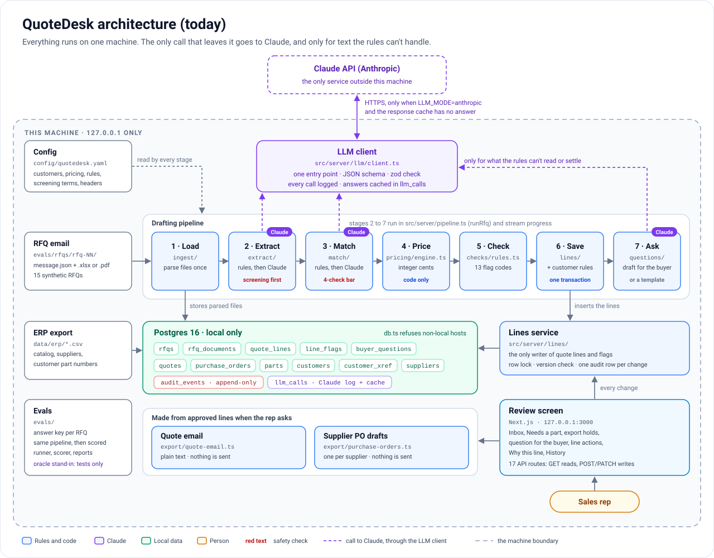

# QuoteDesk

QuoteDesk turns RFQ emails into quotes a sales rep can check and send. It reads the email and its Excel and PDF attachments, pulls out each line item, matches it to the parts catalog from the ERP, and prices it. Then it flags anything a person should look at. The rep approves or edits each line on a review screen, and QuoteDesk writes the quote email. Every change is logged.

It's a rework of TimeDraft: the same stack (Next.js, TypeScript, Postgres, Claude with structured outputs) and the same idea. Rules go first, Claude handles the hard cases, code does all the math, and a person makes the call.

Synthetic data only. Every company, part number, `.example` address and 555-01xx phone number is made up. Two catalog items carry a made-up export flag so the hold path can be shown. There are no real classifications and nothing defense-related.



**Docs:** [Architecture](docs/architecture.md) · [AI agents](docs/ai-agents.md) · [Evals](docs/evals.md) · [Production plan](docs/production.md)

## Run it

You need Node 20.12 or newer, and Postgres 16. Docker is the easy way to get Postgres.

```bash
cp .env.example .env.local        # then add your ANTHROPIC_API_KEY
npm install
npm run db:up                     # Postgres 16 in Docker
npm run db:migrate && npm run db:seed
npm run dev                       # http://localhost:3000 (listens on 127.0.0.1 only)
```

Pick an RFQ from the inbox and QuoteDesk drafts the quote while you watch.

No API key yet? Set `LLM_MODE=oracle` in `.env.local` to use the answer-key stand-in. It answers from the eval keys, so it's only for testing the plumbing and the screen, never for results. The page footer says when it's on. RFQs that need no Claude at all (like rfq-01, a clean spreadsheet) run fine without a key.

No Docker? Any local Postgres works if the app's role can create databases. For example, run `create role quotedesk login createdb password 'quotedesk';` as a superuser, then run the migrate and seed commands above.

Everything stays on this machine. The app listens on 127.0.0.1, Docker publishes Postgres on 127.0.0.1 only, `src/server/db.ts` accepts only localhost database URLs ([one known gap](docs/production.md#gaps-to-close-first)), and nothing in the repo deploys anything.

## The two-minute demo (rfq-03, Harbor Pump)

| Time | On screen |
| --- | --- |
| 0:00 | The inbox: 15 requests from 6 customers, with spreadsheets, PDFs and plain emails |
| 0:10 | Open RFQ 4471. The stages tick by and 7 lines appear, 4 of them priced. The other 3 need a part, a quantity or a replacement first. One line is already approved by Harbor's own rule in the YAML |
| 0:30 | "Needs a part": the buyer wrote "6204", which could be the sealed or the shielded bearing. Claude wasn't sure, so it asked. Pick the sealed one |
| 0:45 | Line 5 is an obsolete sensor. Click "Use AF-40101". The email will say it replaces the old part |
| 0:55 | Line 1 misses the buyer's date: 380 in stock, 500 needed. The flag says what can arrive when |
| 1:05 | Line 3 says "TBD". The question back to the buyer is already drafted. Copy it, or type 40 and watch the price appear |
| 1:20 | "Why this line" on line 7: an extra item read from the email body, with the quote Claude relied on and how the price was built |
| 1:35 | Approve the rest, then "Generate quote email" |
| 1:50 | "Draft supplier POs" for the shortfall, then the History drawer |

For the export hold, open rfq-06 (Summit Packaging). The buyer marked one line export-controlled. It has no price and can't be approved until a named person clears it.

## How it works

```text
email + attachments -> read (.xlsx, .pdf, body) -> extract lines -> match parts -> price and check -> customer rules -> review -> quote email
                                rules first,          rules first,       code only
                                Claude for prose      Claude for hard
                                                      cases, then a bar
```

- **Extraction.** Spreadsheet and PDF tables are read by rules, using the header words in `config/quotedesk.yaml` plus a few built-in fallbacks. So are bullet lines like `- 4 x KF-JM-0606` and numbered lists. Claude reads only free text the rules can't, like "a box of 3/8 hex nuts". It must copy every field from the email, and code parses the values. Code never guesses a value: a missing or unreadable quantity, date or cert type is flagged and becomes a question for the buyer, unless the email gives one need-by date for every line.
- **Matching.** Rules come first. Each customer's own part numbers are checked, then our SKUs, manufacturer and supplier numbers, and aliases (including old numbers), after cleanup (case, spaces, unicode dashes, labels like `P/N:`). Ambiguous numbers, one-character typos and lines with no usable part number go to Claude with their catalog candidates (for the last kind, up to 5 from a description search, if it finds any). Claude's pick counts only if it's a listed candidate, it's confident (`MATCH_THRESHOLD`, 0.80), its quotes really appear in the request, and no size in the request conflicts with the part. Anything else waits in "Needs a part" with Claude's suggestion attached.
- **Pricing.** Code only, in integer cents. The quantity is rounded up to whole packs first. The unit price is then cost / (1 - margin), with the margin from the customer's tier, less the largest quantity break reached, never under the floor. Then the minimum line charge and rush fees are added. Claude's outputs have no field for a price.
- **Flags.** Unknown part, obsolete part (with its replacement), replacement quoted, lead time that misses the date (with what's in stock), short stock, missing quantity, date or cert type (with a drafted question), cert not available, pack size, rush, minimum charge, hand-set price, below the floor margin. All 13 codes and their severities are in [docs/architecture.md](docs/architecture.md#flags).
- **Export holds.** A line is held when the buyer marks it, when its text hits a screening term, or when the ERP flags the part. Screening runs before Claude reads the email, and screened clauses are cut out of the text Claude sees ([known gaps](docs/production.md#gaps-to-close-first)). Held lines get no price and can't be approved until a named person clears them.
- **AI agents.** Claude has three narrow jobs: reading items written as prose, picking parts for the hard cases, and wording the question to the buyer. Each is one structured call through `src/server/llm/client.ts`, with checks in code before and after. See [docs/ai-agents.md](docs/ai-agents.md).
- **Customer rules (stretch).** Per customer in YAML: default certs, rush fee waiver, whether replacements for obsolete parts are fine, quote validity, and auto-approve rules with a fixed vocabulary (`match_method`, `stock_covers`, `no_flags`, `line_total_max_cents`, `categories`). A misspelled key is an error as soon as the config loads. It's the same config-as-source-of-truth pattern as MIA.
- **Supplier POs (stretch).** For approved lines that stock doesn't cover: the shortfall rounded up to the supplier's order multiple, grouped by supplier, as drafts.
- **Audit.** Only `src/server/lines/` writes quote lines and flags. Every change locks the line, checks the version the rep saw, and writes exactly one audit row in the same transaction. A database trigger refuses UPDATE and DELETE on `audit_events`.

The full walk-through, from parts and data model to API and invariants, is in [docs/architecture.md](docs/architecture.md).

## What came from TimeDraft

| TimeDraft | QuoteDesk |
| --- | --- |
| Matters | Customers (YAML) and parts (ERP export in `data/erp/`) |
| Activities matched to matters | Lines matched to parts: rules, then Claude with a bar, then a person |
| Time entries | Quote lines |
| Billing-guideline checks | Pricing and lead-time checks |
| LEDES export | Quote email |
| Review queue, "Why this entry", History | "Needs a part", "Why this line", History |
| Append-only audit, response cache, oracle stand-in, plan-then-render fixtures | Same |

The fixes from the TimeDraft review are built in from the start. `MATCH_THRESHOLD` is validated. Cached answers that fail validation are skipped. Bad model output maps to a 502 and a missing key to a 503, and the drafting stream reports both as error events. Writes are POST or PATCH, never GET. The eval runner refuses to use the oracle on the holdout. Tests that run the pipeline use the dev RFQs only. The Go checker was PointOne-specific, so it isn't here.

## Commands

| Command | What it does |
| --- | --- |
| `npm run dev` | The review screen at localhost:3000 (127.0.0.1 only) |
| `npm run rfq:load -- rfq-03` | Drafts one RFQ from the command line (add `--llm oracle` to skip Claude) |
| `npm test` | 104 tests, including the database-backed service tests (needs local Postgres) |
| `npm run typecheck` | TypeScript, strict |
| `npm run eval -- --split dev` | Scores the 10 dev RFQs and writes `evals/reports/<time>-dev-<llm>.md` (and a `.json` alongside it) |
| `npm run eval -- --split holdout` | The 5 holdout RFQs. Run it once, at the end, with Claude |
| `npm run db:reset` | Empties the RFQ, line, audit, question, quote and PO tables, and reloads the catalog and customers. Keeps Claude's cached answers (`-- --all` clears those too) |
| `npm run fixtures` | Regenerates the ERP export and the 15 RFQs |

Eval flags: `--split dev|holdout|all`, `--llm anthropic|oracle`, `--threshold 0.8`, `--no-cache`.

## Evals

Each of the 15 RFQs is planned first and rendered second, so its answer key never depends on the rendered file. The plan holds the right part, quantity, date and certs for every line. The generator then works out the expected flags and price with its own reference math. 10 RFQs are dev and 5 are holdout. They include customer part numbers, typos, unicode dashes, description-only lines, prose emails, a personal email address, obsolete parts, unknown parts, pack sizes, quantity breaks, rush dates, missing info, cert problems and export holds.

The eval scores four things:

- **Extraction:** lines found, plus quantity, unit, date and certs read right.
- **Matching:** wrong parts placed automatically (target 0), ambiguous lines sent to a person, and the threshold sweep.
- **Safety:** export lines held, held lines priced (target 0), and held text sent to Claude (target 0). That last one is checked on every request the eval sends to Claude, covering the free-text blocks, match requests and question lines. It doesn't cover the `already_found` list, the subject or the sender ([known gaps](docs/production.md#gaps-to-close-first)).
- **Pricing:** prices that match the key's own reference math.

Time to quote is measured as the drafting time per RFQ, plus modeled rep minutes using stated assumptions.

With the oracle stand-in on the dev split, every machinery check passes: all 50 lines found and read, 0 wrong parts, 44/44 prices exact, 3/3 export lines held, and 0 held text sent. These numbers test the plumbing, not Claude.

How the RFQs are built, every metric, and how to read a report are in [docs/evals.md](docs/evals.md).

## Documentation

| Page | What's in it |
| --- | --- |
| [Architecture](docs/architecture.md) | The parts, how an RFQ becomes a quote, the review screen, line lifecycle, write path and audit, pricing, flags, customer rules, data model, API, configuration, invariants |
| [AI agents](docs/ai-agents.md) | Claude's three jobs in detail: what each sees and returns, the checks before and after, the LLM client and cache, export safeguards, the oracle stand-in, changing a prompt safely |
| [Evals](docs/evals.md) | The 15 RFQs, what's scored and why, running and reading an eval, rules for honest numbers |
| [Production plan](docs/production.md) | How QuoteDesk would run for a real distributor, the gaps in today's code to close first, running Claude in production, security, rollout. A plan only: nothing is deployed. |

The diagrams are in `docs/images/`: [the system today](docs/images/architecture.svg), [the AI steps](docs/images/ai-pipeline.svg) and [the planned production design](docs/images/production-architecture.svg).

## Layout

```text
config/quotedesk.yaml    distributor, customers and their rules, pricing, cert and header words (source of truth)
data/erp/                the synthetic ERP export: catalog, suppliers, customer part numbers
db/migrations/           13 tables, append-only audit trigger
docs/                    architecture, AI agents, evals, production plan, and their diagrams
src/server/              ingest, extract, match, pricing, checks, automation, lines, questions, export, llm, pipeline
src/app, src/components  the review screen and 17 API routes
evals/                   generator, 15 RFQs (12 with an attachment), 15 answer keys, runner, scorer
tests/                   104 tests
```

## What's verified, and what isn't yet

Verified in the build sandbox:
- the strict typecheck, all 104 tests and the production build
- the full review flow, driven through the running server: draft, resolve, replace, edit, override, approve, quote email, POs, export clearing and history
- the dev eval with the oracle

Not yet:
- **Real Claude calls.** The sandbox had no API key. The request shape follows TimeDraft's client, but it has never run live. Run `npm run rfq:load -- rfq-03` first: it has a line that's only in the email body, an ambiguous part and a missing quantity, so it exercises all three prompts. Then run the dev eval.
- **Real inboxes.** RFQs come from `evals/rfqs/`, with no IMAP or upload screen yet.
- **Scanned PDFs.** There's no OCR, so a PDF with no text layer yields no lines.
- **Logins and roles.** Anyone can clear an export hold by typing a name. In production that needs a compliance role.
- **Production.** Nothing is deployed. The [production plan](docs/production.md) covers how it would run for real, and the gaps in today's code to close first.
