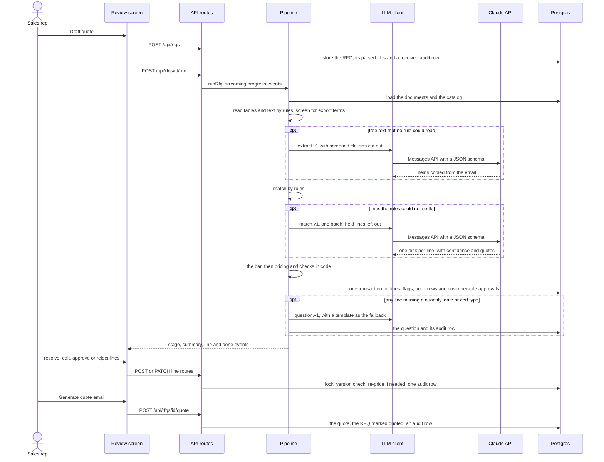
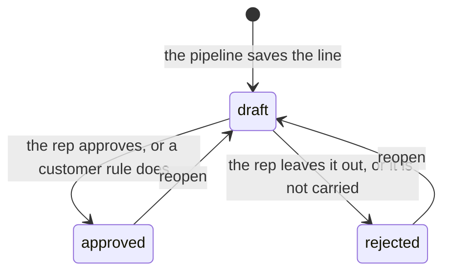
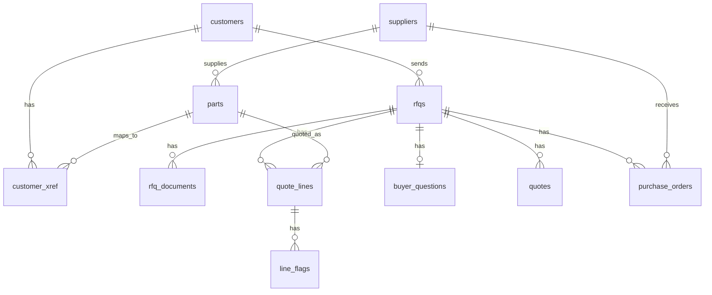

# Architecture

This page covers how QuoteDesk is built today: its parts, how an RFQ moves through them, what is stored where, and the rules the code keeps. Everything runs on one machine. For the Claude steps in depth, see [AI agents](ai-agents.md). For how it would run for a real distributor, see the [production plan](production.md).


## Principles

- **Rules first.** Code handles spreadsheet and PDF tables, bullet and numbered lists, and exact part numbers. Claude only sees what the rules can't read or settle.
- **Code does the math.** Every price comes from [`src/server/pricing/engine.ts`](../src/server/pricing/engine.ts), in integer cents. None of Claude's answer formats has a field for a price.
- **A person makes the call.** Every line starts as a draft. A rep approves, edits or rejects each one. The only exception is a line that a customer's own rule in the YAML approves.
- **Every change is recorded.** Only [`src/server/lines/`](../src/server/lines/) writes quote lines and flags. Every change writes one row to an append-only audit log, in the same transaction as the change.
- **Local only.** The database has to be on localhost, the app listens on 127.0.0.1, and the only outside call is to Claude.

## Parts

| Part | Code | What it does |
| --- | --- | --- |
| Ingest | `src/server/ingest/` | Reads an RFQ fixture (an email, plus an .xlsx or .pdf attachment if there is one) and parses each file once. Works out the customer and stores `rfqs` and `rfq_documents`. |
| Extract | `src/server/extract/` | Finds the line items. Tables are read by header words, bullet and numbered lines by pattern, and prose by Claude. Free text is screened for export terms first. Code parses every quantity, unit, date and cert. |
| Match | `src/server/match/` | Ties each line to a catalog SKU: exact lookups first, then one-character typos, then description search. Hard cases go to Claude, and Claude's pick has to clear the bar. |
| Price | `src/server/pricing/engine.ts` | Pack rounding, tier margin, quantity breaks, the floor, the minimum line charge, lead time, rush and the rush fee. Integer cents only. |
| Check | `src/server/checks/rules.ts` | Raises the 13 flag codes, each with a severity of block, warn or info. |
| Customer rules | `src/server/automation/rules.ts` | Applies each customer's auto-approve rules from the YAML. |
| Lines service | `src/server/lines/` | The only writer of `quote_lines` and `line_flags`. Every rep change takes a row lock, checks the version and writes one audit row. Edits, part picks, export clearances and the "not carried" actions also re-price and re-flag the line. |
| Questions | `src/server/questions/` | Drafts one email to the buyer about missing quantities, dates or cert types. |
| Outputs | `src/server/export/` | Builds the quote email and the supplier PO drafts as plain text. Nothing is sent. |
| LLM client | `src/server/llm/` | The only way to reach Claude. It holds the prompts and handles structured outputs, zod checks, logging and the response cache. |
| Pipeline | `src/server/pipeline.ts` | Runs the stages for one RFQ and streams progress to the screen. |
| Database | `src/server/db.ts`, `db/migrations/` | Local-only connection pools, transactions, migrations and seeding. |
| Web app | `src/app/`, `src/components/` | The inbox, the review screen and 17 API routes. |
| Config | `config/quotedesk.yaml`, `src/lib/config.ts` | The distributor, pricing, certs, header words, screening terms, customers and their rules. Strictly validated. |
| ERP export | `data/erp/` | The synthetic catalog, suppliers and customer part numbers, copied into Postgres by `npm run db:seed`. |
| Evals | `evals/` | The fixture generator, the 15 RFQs and their answer keys, and the runner and scorer. See [Evals](evals.md). |

## How an RFQ becomes a quote



1. **Load.** Clicking "Draft quote" in the inbox sends `POST /api/rfqs` with the fixture id. `ingestFixture` parses the email and its attachment once and identifies the customer. It checks the sender's domain first, then looks for exactly one customer name in the last 8 lines of the body. It sets the quote date to the arrival day in the distributor's time zone. Then it writes `rfqs`, `rfq_documents` and a `received` audit row in one transaction. Loading the same fixture again returns the RFQ that's already there.
2. **Run.** The review page starts `POST /api/rfqs/{id}/run`, which streams server-sent events:
   - `stage`, with a stage name: `read`, `extract`, `match`, `price`, `save` or `question`
   - `summary`
   - `line`
   - `done` or `error`

   An RFQ that's already drafted or quoted just returns `done`.
3. **Read and extract.**
   - Tables come first. A header row needs a quantity column and a part or description column, recognized by the header words in the YAML or a few built-in fallbacks.
   - The rest of the PDF text and the email body are free text. Rules read numbered lines like `3. Prox sensor M12, VE-PX12-4P-C - qty 10` and bullets with a known part number like `- 4 x KF-JM-0606`.
   - Every free-text line is screened for export terms.
   - If a line still looks like an item (it has a digit and an item word such as screws, bearings or valves) and no rule read it, Claude reads the free text, with the screened clauses cut out.
   - Code then parses every quantity, unit, date and cert. An email-wide need-by date ("Need everything by Oct 20") fills in lines that have none. Email-wide certs and the customer's default certs are added to every line.
4. **Match.**
   - Each line goes through the rules: the customer's own part numbers first, then one shared lookup over our SKUs, manufacturer and supplier part numbers, and aliases. Lookups ignore case, spaces, unicode dashes and labels like `P/N:`.
   - A single exact hit is matched.
   - Three kinds of line go to Claude in one batched call, each with its candidates: ambiguous numbers, numbers one character off (6 characters or longer), and lines where the part number found nothing (or there isn't one) but a description search found candidates.
   - Lines held for export (marked by the buyer or caught by screening) are left out.
   - Claude's pick counts only if it clears the bar (see [AI agents](ai-agents.md#job-2-pick-a-part-matchv1)). Otherwise the line waits in "Needs a part", with Claude's suggestion kept.
5. **Price and check.**
   - If the customer allows substitutes, an obsolete part is swapped for its listed replacement.
   - A line held for export gets no price. A line can be held because the buyer marked it, screening caught it, or the ERP flags the part.
   - Every other line with an active part and a quantity is priced in code and checked for flags.
6. **Save.** One transaction inserts every line with its flags and a `created` audit row, applies the customer's auto-approve rules, and marks the RFQ `drafted`. If anything fails, nothing is saved.
7. **Ask.** If any line is missing a quantity, a need-by date or a cert type, QuoteDesk drafts one question email to the buyer. Claude writes it, with a template as the fallback. Lines held for export are left out.
8. **Review.** The rep works through "Needs a part", the export holds, the question and the lines.
   - Every action locks the line, checks the version the rep saw, and writes one audit row.
   - Edits, part picks and export clearances also re-price the line.
9. **Quote.**
   - Once no line is still a draft and at least one priced line is approved, "Generate quote email" builds the email in code and marks the RFQ `quoted`.
   - "Draft supplier POs" covers approved lines that stock doesn't cover.
   - Both are text for the rep to copy. Nothing is sent.

## The review screen

| Area | What it shows | What the rep can do |
| --- | --- | --- |
| Header | Sender, customer and tier, the quote date, the customer's rules, links to the attachments, the raw email | Open an attachment |
| Summary bar | Total, approved count, margin, lines that need the rep, rush fees | **Generate quote email** (once no drafts are left and at least one line is approved), **Draft supplier POs** (when an approved line is short on stock) |
| Needs a part | Draft lines that still need a part and aren't held, because Claude's pick didn't clear the bar or nothing in the catalog fit. Shows Claude's suggestion and confidence, any size conflict, the candidates and a catalog search | Pick a part (`POST /api/lines/{id}/resolve`), or "We don't carry this", which leaves the line out as "Not a catalog item" |
| Held for export review | Draft lines with an uncleared hold, and why each one is held | Clear the hold with a reviewer name and what was checked (`POST /api/lines/{id}/clear-export`), or leave the line out |
| Question for the buyer | The drafted email, and whether Claude or the template wrote it | Edit and save it, copy it, or mark it as sent. Marking it sent sends nothing |
| Lines | For each line: the part, quantity, need-by date, certs, flags and how the price was built | **Approve** (it asks for a reason if a blocking flag is unresolved), **Edit** (with a live price preview), **Leave out**, **Reopen**, **Use AF-xxxxx** (swaps an obsolete part for its replacement), **Why this line**, **History** |
| Footer | Where prices come from, the drafting time, and a notice when the oracle stand-in answered | |

"Why this line" shows where the line came from: the spreadsheet row, or the text around the quote. It also shows how the part was matched, with the evidence, Claude's suggestion and the candidates, and every step of the price build-up. "History" lists every change to the line, newest first, from the append-only audit log.

## Line lifecycle



- **Status** is `draft`, `approved` or `rejected`. Only draft lines can be edited, resolved or cleared. An approved line has to be reopened before it can be rejected.
- **Match status:**
  - `auto` means the rules or Claude matched the line without a person.
  - `needs_review` means the line is waiting in "Needs a part".
  - `resolved` means a person picked the part.
  - If the rep changes the part on an `auto` line, it stays `auto` but its match method becomes `rep`.
  - Reopening a "not carried" line puts it back in "Needs a part".
- **Export holds:**
  - `marked` (the buyer marked it) and `screened` (a screening term matched) are permanent.
  - A `catalog` hold follows the part: picking a different part adds or drops it.
  - A hold is cleared once, with a reviewer name and a reason.
  - While held, a line has no price, approving it returns 409, the question to the buyer leaves it out, and the quote email says only that the item needs review.

## The write path

Every change to a line follows the same steps, in [`src/server/lines/service.ts`](../src/server/lines/service.ts):

1. The API route checks the request body with zod. A bad shape or an unknown key returns 400.
2. The service opens a transaction and locks the row with `select ... for update`. If the version the screen sent doesn't match, it returns 409 "This line changed since you loaded it".
3. The service checks the business rules, returning 409 or 422 when one fails:
   - only drafts can be edited
   - a hand-set price needs a reason
   - approving past a blocking flag needs a reason
   - a held line can't be approved
4. For edits, part picks, export clearances, marking a line "not carried" and reopening a not-carried line, it re-prices and re-flags the line with [`evaluateLine`](../src/server/lines/evaluate.ts), the same function the pipeline uses.
5. It updates the row and bumps its version, rewrites the line's flags if it was re-evaluated, and inserts exactly one `audit_events` row.
6. It commits. The route reads the line back and returns it.

Override reasons are stored on the flag rows. An edit clears them, so the next approval needs a fresh reason. Reopening keeps them.

The audit actions are:
- for lines: `created`, `edited`, `part_chosen`, `not_carried`, `approved`, `rejected`, `reopened`, `export_cleared`
- for RFQs: `received`
- for questions: `drafted`, `edited`, `marked_sent`
- for quotes: `generated`
- for POs: `drafted`

The actor is `system` for pipeline writes, `rule:<customer>/<rule name>` for customer-rule approvals, and `rep:MO` for every rep action. There are no logins yet; see the [production plan](production.md).

A database trigger, defined in [`db/migrations/001_init.sql`](../db/migrations/001_init.sql), raises an error on any `UPDATE` or `DELETE` of `audit_events`. `TRUNCATE` skips row triggers, and `npm run db:reset` relies on that to empty the local tables. That is acceptable only because the database is local.

No database transaction stays open during a Claude call. The extract and match calls happen before the save transaction starts, and the question call happens before its own small transaction.

## Pricing

[`priceLine`](../src/server/pricing/engine.ts) works in integer cents and basis points:

1. **Units.** A line asked for in packs is converted to pieces (packs × pack size).
2. **Billed quantity.** The quantity is rounded up to whole packs.
3. **Margin.** The tier margin (A 18%, B 24%, C 30%), less the largest quantity break the billed quantity reaches (100: 2 points, 500: 4 points, 2,000: 6 points), never below the 10% floor. Breaks don't add up.
4. **Unit price.** cost / (1 − margin), rounded up to the cent: `ceilDiv(cost × 10000, 10000 − margin_bps)`. Because it rounds up, a list price can never fall below the floor.
5. **Hand-set price.** If the rep sets a unit price, it replaces the list price, and the list price and the real margin are still shown. A hand-set price below the floor raises `BELOW_FLOOR`.
6. **Extended price.** Unit price × billed quantity, topped up to the $15.00 minimum line charge.
7. **Dates.** A line fully in stock ships after 1 handling day. Otherwise it ships after the part's lead time plus that day. It arrives 2 business days after shipping. Weekends and the distributor's holidays are skipped.
8. **Rush.** When the full quantity is in stock but normal shipping misses the need-by date, the line ships the same day with 1-day transit, if that makes the date. The rush fee is 15% of the line, at least $25, unless the customer has the fee waived. Rush is applied automatically.
9. **Short stock.** When stock covers only part of the quantity, the line says how many can arrive and when.

The line total is the extended price, plus any minimum-charge top-up, plus any rush fee. For example (from `tests/pricing.test.ts`): cost 41¢, 500 asked, sold in packs of 50, tier A. That bills 500 at a margin of 18% − 4% = 14%, for a unit price of ⌈41 / 0.86⌉ = 48¢ and a line total of $240.00.

## Flags

[`checkLine`](../src/server/checks/rules.ts) raises these 13 codes:

| Code | Severity | When |
| --- | --- | --- |
| `EXPORT_CONTROLLED` | block, or info once cleared | The line is held for export review. |
| `UNKNOWN_PART` | block | There is no part yet and the line is in "Needs a part". |
| `OBSOLETE_PART` | block | The part is obsolete. The flag names its replacement. |
| `SUBSTITUTED` | warn | A replacement is quoted for an obsolete part. |
| `MISSING_INFO` | block (warn if only the date is missing) | The quantity, need-by date or cert type is missing. A question for the buyer is drafted. |
| `CERT_UNAVAILABLE` | warn | A requested cert isn't offered for the part. |
| `PACK_ROUNDED` | warn | The billed quantity was rounded up to whole packs. |
| `LEAD_TIME_MISS` | warn | Arrival misses the need-by date. The flag says how much stock can arrive and when. |
| `STOCK_SHORT` | info | The line isn't fully in stock. |
| `RUSH_FEE` | info | The line ships rush to make the date. The flag says whether the fee is waived. |
| `MIN_LINE` | info | The line was topped up to the minimum line charge. |
| `PRICE_OVERRIDE` | warn | The unit price was set by hand. |
| `BELOW_FLOOR` | block | A hand-set price is below the floor margin. |

Lines without a price (held, obsolete, no part, or no quantity) never get the price-based flags, from `PACK_ROUNDED` down. Approving a line that has an unresolved blocking flag needs a reason, and the reason is kept on the flag and in the audit row.

## Customer rules

Each customer's `rules` in `config/quotedesk.yaml` use a fixed set of keys. An unknown key, such as `stock_cover`, is an error when the config loads.

| Key | Effect |
| --- | --- |
| `default_certs` | Added to every line for this customer, with a note. |
| `rush_fee_waived` | Rush still applies, but the fee is zero. |
| `substitutes` | `ask` (the default): an obsolete part is flagged and the rep swaps it. `allow`: the replacement is quoted when the line is drafted. |
| `quote_valid_days` | Overrides the default of 30 days. |
| `auto_approve` | A list of named rules, each with a `when`. |

The keys under `when` are `match_method`, `stock_covers`, `no_flags` (info flags don't count), `line_total_max_cents` and `categories`. Every condition a rule lists has to hold, and the first rule that passes wins. Every rule also requires a draft line with a part, a price and no export hold, cleared or not. Auto-approval runs once, when the pipeline saves the line, and never again after edits.

As shipped, Harbor Pump has "In-stock catalog parts under $500" and Summit Packaging has "Bulk consumables in stock under $2,000". Cedar Ridge allows substitutes, Bayfront Marine's quotes are valid for 15 days, and Summit's rush fees are waived.

## Data model

[`db/migrations/001_init.sql`](../db/migrations/001_init.sql) creates 13 tables. `migrate()` also keeps a `schema_migrations` table.

| Table | What it holds |
| --- | --- |
| `suppliers` | The supplier master (4 suppliers). |
| `parts` | The catalog from the ERP export: cost, stock, lead time, pack size, supplier order multiple, status, replacement, export flag, certs and aliases. |
| `customers` | Customers from the YAML, with their rules. |
| `customer_xref` | Customers' own part numbers. |
| `rfqs` | One row per RFQ email: the customer and how it was identified, the quote date, the status (`ingested`, `drafted`, `quoted` or `failed`), the email-wide defaults and the drafting time. |
| `rfq_documents` | The email body and each attachment, parsed once: sheets and rows, or PDF lines with positions, or text. |
| `quote_lines` | One row per line: its source and the buyer's words, the parsed values, the match and its evidence, the export hold, the price (JSON from the engine), the status and a version number. |
| `line_flags` | The current flags on each line, with any override reason. |
| `buyer_questions` | The one question email per RFQ. |
| `audit_events` | The append-only history of every change. |
| `llm_calls` | Every Claude call: the request, the response, tokens, latency and stop reason. Also the response cache. |
| `quotes` | Generated quote emails and their numbers. |
| `purchase_orders` | Supplier PO drafts. |



`audit_events` and `llm_calls` have no foreign keys. Audit rows point at their subject by type and id.

## API

All 17 routes live under [`src/app/api/`](../src/app/api/). Six read with GET, nine write with POST and two write with PATCH. Nothing writes on a GET.

| Method | Path | What it does |
| --- | --- | --- |
| GET | `/api/fixtures` | The inbox: every fixture and its drafting status. |
| POST | `/api/rfqs` | Loads a fixture. Returns 201 for a new RFQ, 200 if it was already loaded. |
| GET | `/api/rfqs/{id}` | The full review view. |
| POST | `/api/rfqs/{id}/run` | Runs the pipeline and streams server-sent events. |
| GET | `/api/rfqs/{id}/attachments/{name}` | The original attachment. |
| POST | `/api/rfqs/{id}/quote` | Generates the quote email. Returns 409 while any line is a draft. |
| POST | `/api/rfqs/{id}/pos` | Drafts supplier POs. Returns 422 when stock covers every approved line. |
| PATCH | `/api/rfqs/{id}/question` | Edits the question to the buyer, or marks it sent. |
| GET | `/api/parts?q=&customer=` | Catalog search for the part picker. Returns up to 8 parts. |
| PATCH | `/api/lines/{id}` | Edits the part, quantity, unit, need-by date, certs or hand-set price. |
| POST | `/api/lines/{id}/approve` | Approves a line. A reason is needed past a blocking flag. |
| POST | `/api/lines/{id}/reject` | Leaves a line out, with a reason. |
| POST | `/api/lines/{id}/reopen` | Puts a line back to draft. |
| POST | `/api/lines/{id}/resolve` | Picks a part, or marks the line as not carried. |
| POST | `/api/lines/{id}/clear-export` | Clears an export hold, with a reviewer name and a reason. |
| GET | `/api/lines/{id}/history` | The line's audit history, newest first. |
| GET | `/api/lines/{id}/sources` | "Why this line": the source, the match evidence and the price build-up. |

Errors come back as JSON:
- 400 for a body that fails validation
- 404 when something doesn't exist
- 409 for a stale version or the wrong state
- 422 when a business rule fails

Every line write and every edit to the buyer question sends the version the screen loaded. Loading, running, generating the quote and drafting POs don't send one. Once its stream starts, the run route answers 200 and reports most problems as `error` events in the stream. An RFQ id that was never loaded closes the stream with no events.

## Configuration and environment

`config/quotedesk.yaml` is the source of truth for:
- the distributor: name, rep, time zone and holidays
- pricing: tiers, quantity breaks, floor, minimum line charge, lead time, rush and quote validity
- certs and their synonyms
- extraction: header words, units, the rows that end a table, and the export screening terms
- matching: synonyms and stop words
- customers: domains, contacts and rules
- the eval time model

Every object in the config is strict, so a key the schema doesn't know is an error. On top of that, customer ids must be unique, quantity breaks must go up, and no tier margin may sit below the floor. The config is read once per process, so restart after editing it.

| Variable | Default | What it does |
| --- | --- | --- |
| `DATABASE_URL` | none (required) | The dev database. It must be on localhost. |
| `EVAL_DATABASE_URL` | none (required for tests and evals) | The eval database, which tests reset. |
| `ANTHROPIC_API_KEY` | none | Needed only when Claude is called and the response cache has no answer. |
| `LLM_MODE` | `anthropic` | `oracle` uses the answer-key stand-in, for testing only. |
| `LLM_CACHE` | `on` | `off` always calls Claude. Calls are still logged. |
| `MATCH_THRESHOLD` | `0.8` if unset | The confidence Claude's part pick must reach. It has to be above 0 and at most 1. |
| `MODEL_EXTRACT` | `claude-sonnet-5-5` | The model for reading free text. |
| `MODEL_MATCH` | `claude-haiku-4-5-20251001` | The model for picking parts. |
| `MODEL_WRITE` | `claude-sonnet-5-5` | The model for wording the question to the buyer. |

The app loads `.env.local` and then `.env`. Variables already set in the shell win. Both files are in `.gitignore`.

## Outputs

**Quote email** ([`src/server/export/quote-email.ts`](../src/server/export/quote-email.ts)):
- It's built only from approved, priced lines.
- Each line says what was quoted, any pack rounding, "Replaces … which is discontinued" for substitutes, when it arrives (or rush, or partial shipment), any minimum charge, and which certs are included or unavailable.
- Lines that aren't quoted get a short note that's safe to send to the customer. Internal reasons never appear.
- The quote number is `Q-<customer digits>-<YYYYMMDD>`, with `-2`, `-3` and so on for later versions.
- The quote is valid for 30 days (15 for Bayfront), counted in calendar days.

**Supplier PO drafts** ([`src/server/export/purchase-orders.ts`](../src/server/export/purchase-orders.ts)):
- They cover approved lines that stock doesn't cover.
- The shortfall (billed quantity − stock) is rounded up to the supplier's order multiple (the `supplier_moq` column).
- The needed-by date is worked back from the buyer's date by the handling and transit days. With no buyer date, it's the quote date plus the lead time.
- There's one PO per supplier, numbered `PO-<supplier code>-<YYYYMMDD>-<n>`.

Both are saved with an audit row, and neither is sent.

## Running it locally

The commands are in the [README](../README.md#run-it). A few details:

- `npm run dev` and `npm run start` listen on 127.0.0.1 only (`-H 127.0.0.1`), and `docker-compose.yml` publishes Postgres on 127.0.0.1 only. `http://localhost:3000` works.
- **No Docker?** Any local Postgres works if the app's role can create databases. For example, run `create role quotedesk login createdb password 'quotedesk';` as a superuser, then `npm run db:migrate && npm run db:seed`. The migration creates `quote_desk_dev`. The test suite migrates and resets `quote_desk_eval` itself, once `EVAL_DATABASE_URL` is set in `.env.local`.
- **No API key?** Set `LLM_MODE=oracle` to test the plumbing and the screen. RFQs that need no Claude, such as rfq-01, run fine without a key.
- `npm test` runs 104 tests. The 11 in `tests/service.test.ts` need the local eval database.

## Invariants and where they live

| Rule | Where it's enforced |
| --- | --- |
| Claude never sets a price. | None of the answer schemas has a price field (`src/server/llm/prompts/`, `src/lib/schemas.ts`). Prices come only from `pricing/engine.ts`, through `lines/evaluate.ts`. |
| Only `src/server/lines/` writes quote lines and flags, with one audit row per change. | `lines/service.ts` and `lines/audit.ts`. |
| `audit_events` is append-only. | The trigger in `db/migrations/001_init.sql`. |
| Every Claude call goes through the client. | `callStructured` in `src/server/llm/client.ts`. |
| A Claude match counts only if it clears the bar. | `decide()` in `src/server/match/index.ts`. |
| Export screening runs before Claude. Held lines get no price and need a named person to clear them. | `extract/index.ts` and `extract/text.ts` (screening), `match/index.ts` (held lines are never sent), `lines/evaluate.ts` (no price), and `clearExport` in `lines/service.ts`. The [production plan](production.md#gaps-to-close-first) lists the gaps. |
| `MATCH_THRESHOLD` is above 0 and at most 1. | `parseThreshold()` in `src/server/match/index.ts`. |
| The oracle is for tests only, and the holdout refuses it. | `evals/run.ts`. This is the only place that checks; see the [production plan](production.md#gaps-to-close-first). |
| Unknown YAML keys are an error. | Strict zod objects in `src/lib/config.ts`. |
| Local Postgres only. | `assertLocal()` in `src/server/db.ts`. See the [production plan](production.md#gaps-to-close-first) for a gap. |

## Code map

```text
config/quotedesk.yaml        distributor, pricing, certs, header words, screening terms, customers and rules
data/erp/                    the synthetic ERP export: catalog, suppliers, customer part numbers
db/migrations/001_init.sql   13 tables, checks, indexes, the append-only audit trigger
docs/                        these docs and their diagrams
evals/                       generate.ts (fixtures and keys), run.ts (runner), score.ts (scorer and oracle), rfqs/, keys/
scripts/                     db.ts (migrate, seed, reset), load-rfq.ts (draft one RFQ from the command line)
src/app/                     the inbox and review pages, and api/ with its 17 routes
src/components/              LineRow, Panels, Drawers and shared bits
src/lib/                     config, request and answer schemas, types, dates, formatting
src/server/ingest/           fixture.ts, xlsx.ts, pdf.ts
src/server/extract/          index.ts, table.ts, text.ts, parse.ts
src/server/match/            index.ts (the bar), rules.ts, normalize.ts
src/server/pricing/          engine.ts
src/server/checks/           rules.ts
src/server/automation/       rules.ts
src/server/lines/            service.ts, evaluate.ts, audit.ts
src/server/questions/        index.ts, template.ts
src/server/export/           quote-email.ts, purchase-orders.ts
src/server/llm/              client.ts, cache.ts, prompts/
src/server/erp/              catalog.ts
src/server/                  db.ts, pipeline.ts, rfqs.ts
tests/                       7 files, 104 tests
```
